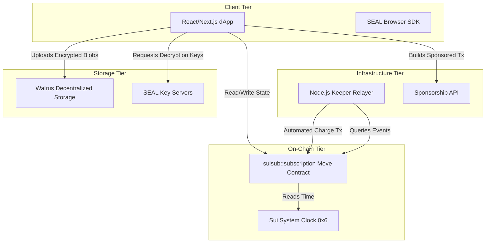
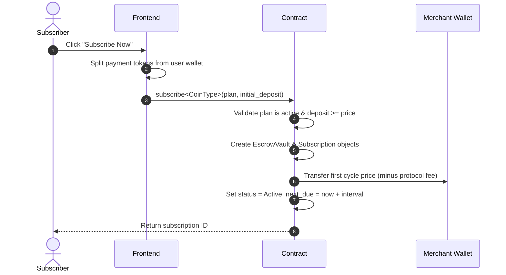
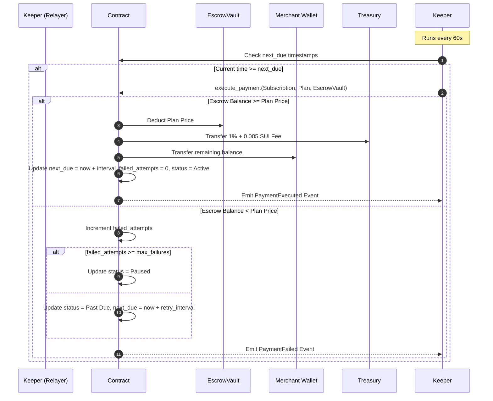
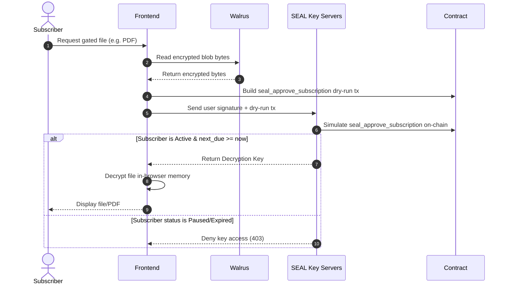

# Technical Architecture — suisub

This document details the software architecture, database/on-chain models, and operational sequences of **suisub**.

---

## 1. System Topology

**suisub** relies on a three-tier Web3 architecture combining on-chain state, automated background processors, and client-side interfaces.

---

## 2. On-Chain Structs & Move Contracts

The core contract is `suisub::subscription`, which manages three main shared objects:

### 2.1 `SubscriptionPlan<phantom CoinType>`
Stores the configuration of a creator's subscription tier. It is generic over the `CoinType` (e.g. SUI, USDC, USDT).
* `id: UID`: On-chain object identifier.
* `merchant: address`: The creator's wallet address that receives the funds.
* `name: String`: Name of the subscription plan.
* `price: u64`: Cost per billing cycle (in base units).
* `interval_ms: u64`: Plan duration (e.g. 30 days in ms).
* `grace_period_ms: u64`: Fixed to 3 days (hardcoded).
* `retry_interval_ms: u64`: Fixed to 12 hours (hardcoded).
* `max_failures: u64`: Fixed to 3 (hardcoded).
* `active: bool`: Pause/resume toggle controlled by the merchant.

### 2.2 `EscrowVault<phantom CoinType>`
Holds the subscriber's pre-funded token balance. The keeper can only debit from this vault when payment is due.
* `id: UID`: On-chain object identifier.
* `owner: address`: The subscriber's wallet address.
* `balance: Balance<CoinType>`: Token balance.

### 2.3 `Subscription<phantom CoinType>`
Links a subscriber to a plan and tracks payment history.
* `id: UID`: On-chain object identifier.
* `plan_id: ID`: Reference to the `SubscriptionPlan`.
* `escrow_id: ID`: Reference to the `EscrowVault`.
* `subscriber: address`: Subscriber wallet.
* `merchant: address`: Creator wallet.
* `last_paid: u64`: Epoch timestamp of last successful charge.
* `next_due: u64`: Epoch timestamp of next scheduled charge.
* `grace_until: u64`: Expiration timestamp of grace period.
* `failed_attempts: u64`: Consecutive failed charge attempts.
* `status: u8`: Lifecycle status (Active: 0, Past Due: 1, Paused: 2, Canceled: 3).

---

## 3. Core Sequences

### 3.1 Subscription & Escrow Setup
When a subscriber signs up, they submit a single transaction that creates the Personal Escrow, deposits funds, and establishes the subscription state.

### 3.2 Automated Recurring Payment Execution
The Relayer daemon manages recurring charges by checking the next due dates.

---

## 4. Decentralized Content Gating (Walrus + SEAL)

For products that gate assets, the decryption sequence involves checking subscription status cryptographically:

